# Functional Requirements Document (FRD)
## Assetica - Multi-Tenant SaaS Platform

**Comprehensive Asset Management Solution**

---

## Document Control

| Version | Date | Author | Description |
|---------|------|--------|-------------|
| 1.0 | Oct 21, 2025 | Assetica Development Team | Initial FRD based on BRD and stakeholder discussions |

---

## Product Overview

**Assetica** is a modern, cloud-based asset management platform designed to streamline the complete lifecycle of organizational assets. Built on a robust multi-tenant SaaS architecture, Assetica empowers IT organizations to efficiently register, track, maintain, and optimize their physical and digital assets.

### Vision
To be the most intuitive and comprehensive asset management solution that transforms how organizations manage their resources.

### Mission
Deliver a seamless, secure, and scalable platform that provides complete visibility and control over asset lifecycles, enabling data-driven decisions and operational excellence.

---

## Table of Contents
1. [Executive Summary](#1-executive-summary)
2. [System Overview](#2-system-overview)
3. [User Roles & Permissions](#3-user-roles--permissions)
4. [Functional Requirements](#4-functional-requirements)
5. [Business Rules](#5-business-rules)
6. [Workflows](#6-workflows)
7. [Data Model](#7-data-model)
8. [User Interface Requirements](#8-user-interface-requirements)
9. [Integration Requirements](#9-integration-requirements)
10. [Reporting & Analytics](#10-reporting--analytics)
11. [Non-Functional Requirements](#11-non-functional-requirements)
12. [Assumptions & Constraints](#12-assumptions--constraints)

---

## 1. Executive Summary

### 1.1 Purpose
This document defines the detailed functional requirements for **Assetica**, a multi-tenant SaaS asset management platform designed primarily for IT organizations. Assetica enables organizations to register, track, maintain, audit, and report on assets throughout their lifecycle.

### 1.2 Scope
**Phase 1 (MVP) includes:**
- Asset Registration & Inventory Management
- Asset Assignment & Transfer Tracking
- QR/Barcode Generation & Mobile Scanning
- Software License Management
- User & Role Management
- Employee Master Management
- Depreciation Calculation
- Basic Maintenance Tracking
- Email Notifications
- Reports & Dashboards
- Bulk Import/Export
- Audit Trail
- Multi-Tenant Architecture

**Deferred to Phase 2:**
- Advanced Maintenance Scheduling & Automation
- Full Procurement Workflow (PR → PO → GRN)
- Physical Audit Reconciliation Module
- Vendor Rating & Performance Analytics
- Advanced Budget Tracking
- IoT/RFID Integration

### 1.3 Target Users
- **Super Admin:** Assetica platform administrator
- **Tenant Admin:** Organization IT/Asset managers
- **IT Team:** Asset registration and management staff
- **Finance Team:** Cost and depreciation tracking
- **Managers/Department Heads:** Approval authority
- **Employees:** End users with assigned assets

### 1.4 Technology Stack
- **Backend:** .NET Core (ASP.NET Core Web API)
- **Frontend:** Angular 16+
- **Database:** PostgreSQL
- **Cloud:** AWS/Azure
- **Mobile:** Progressive Web App (PWA) for Phase 1

---

## 2. System Overview

### 2.1 Architecture Pattern
- **Multi-Tenant SaaS Model** with complete data isolation per tenant
- **RESTful API** architecture
- **Role-Based Access Control (RBAC)**
- **Microservices-ready** modular design

### 2.2 Key Modules

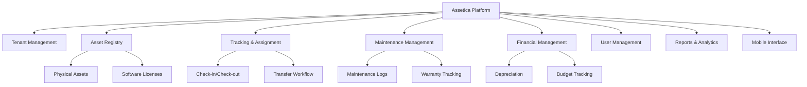

---

## 3. User Roles & Permissions

### 3.1 Role Hierarchy

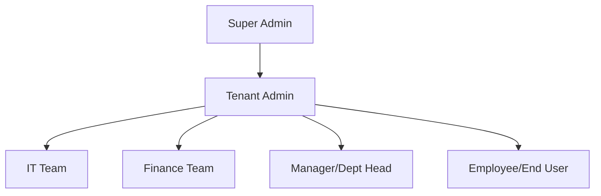

### 3.2 Role Definitions & Permissions

| Role | Access Level | Key Permissions |
|------|--------------|-----------------|
| **Super Admin** | Platform-wide | - Manage all tenants<br>- Create/edit/deactivate tenants<br>- System configuration<br>- Platform analytics |
| **Tenant Admin** | Tenant-wide | - Full access within tenant<br>- User management<br>- System configuration<br>- All modules access<br>- Report access |
| **IT Team** | Department-wide | - Asset registration & assignment<br>- Maintenance management<br>- Check-in/check-out<br>- Barcode generation<br>- Asset transfers |
| **Finance Team** | Read + Finance ops | - View all assets<br>- Depreciation management<br>- Cost tracking<br>- Disposal approval<br>- Financial reports |
| **Manager/Dept Head** | Department-specific | - View department assets<br>- Approve requests & transfers<br>- Department reports |
| **Employee** | Self-only | - View assigned assets<br>- Request new assets<br>- Report issues<br>- Asset return initiation |

### 3.3 Permission Matrix

| Module | Super Admin | Tenant Admin | IT Team | Finance | Manager | Employee |
|--------|-------------|--------------|---------|---------|---------|----------|
| Tenant Management | Full | - | - | - | - | - |
| Asset Registration | View All | Full | Create/Edit | View | View Dept | - |
| Asset Assignment | View All | Full | Full | View | View Dept | View Own |
| Asset Transfer | View All | Full | Execute | View | Approve | Request |
| Maintenance | View All | Full | Full | View | View Dept | Report Issue |
| Depreciation | View All | Full | - | Full | - | - |
| User Management | Full | Full | - | - | - | - |
| Reports | All Tenants | All | Department | Financial | Department | Personal |
| Configuration | Platform | Tenant | - | - | - | - |

---

## 4. Functional Requirements

### 4.1 Tenant Management Module

#### 4.1.1 Tenant Onboarding
**Actors:** Super Admin

**Functional Requirements:**

| ID | Requirement | Priority |
|----|-------------|----------|
| TM-001 | Super Admin can create new tenant with: Company Name, Domain, Contact Details, License Type, User Limit | Must Have |
| TM-002 | System auto-generates unique Tenant ID and subdomain (e.g., `acmecorp.assetica.io`) | Must Have |
| TM-003 | System creates default Tenant Admin account upon tenant creation | Must Have |
| TM-004 | Each tenant has completely isolated database schema/namespace | Must Have |
| TM-005 | Tenant can customize: Logo, Color Theme, Email Templates, Asset Categories | Must Have |
| TM-006 | Super Admin can view all tenant statistics (user count, asset count, storage used) | Should Have |
| TM-007 | Super Admin can suspend/activate tenant accounts | Must Have |
| TM-008 | System tracks tenant subscription status and expiry | Must Have |

#### 4.1.2 Tenant Configuration
**Actors:** Tenant Admin

| ID | Requirement | Priority |
|----|-------------|----------|
| TM-101 | Tenant Admin can configure custom asset categories beyond defaults | Must Have |
| TM-102 | Tenant Admin can define custom fields for assets (text, number, dropdown, date) | Must Have |
| TM-103 | Tenant Admin can configure depreciation rates per asset category | Must Have |
| TM-104 | Tenant Admin can customize email notification templates | Should Have |
| TM-105 | Tenant Admin can configure approval workflows per transaction type | Must Have |
| TM-106 | Tenant Admin can set alert thresholds (warranty expiry: 30 days default) | Must Have |
| TM-107 | Tenant Admin can manage organization hierarchy (locations, departments) | Must Have |

---

### 4.2 Asset Registration & Inventory Module

#### 4.2.1 Asset Categories (Default)

**Pre-configured Categories for IT Assets:**
- Laptops/Desktops
- Monitors
- Mobile Phones/Tablets
- Servers & Networking Equipment
- Peripherals (Keyboard, Mouse, Headsets, Docking Stations)
- Software Licenses (Perpetual & Subscription)

#### 4.2.2 Asset Master Creation

**Actors:** IT Team, Tenant Admin

| ID | Requirement | Priority |
|----|-------------|----------|
| AR-001 | Create new asset with mandatory fields: Asset Name, Category, Purchase Date, Purchase Cost | Must Have |
| AR-002 | System auto-generates Asset ID using format: `<CATEGORY>-<YEAR>-<INCREMENT>`<br>Example: `LAP-2025-0001`, `MON-2025-0045` | Must Have |
| AR-003 | Capture optional fields: Serial Number, MAC Address, Model, Brand, Vendor, Invoice Number, Warranty Expiry, Location, Department | Must Have |
| AR-004 | Upload asset images (max 5 images per asset, max 5MB each, formats: JPG, PNG) | Should Have |
| AR-005 | Attach documents (Invoice, Warranty Card, Insurance, max 10MB per file, formats: PDF, DOCX, JPG) | Should Have |
| AR-006 | Auto-calculate depreciation start date = Purchase Date | Must Have |
| AR-007 | Auto-generate QR code with full asset URL upon asset creation | Must Have |
| AR-008 | Print individual or bulk asset labels (QR code + Asset ID + Name) | Must Have |
| AR-009 | Set initial asset status as "Available" after creation | Must Have |
| AR-010 | Support custom fields configured by Tenant Admin | Must Have |

#### 4.2.3 Asset Status Management

**Defined Asset Statuses:**
- **Available:** Asset created but not assigned
- **Active:** Asset assigned and in use
- **Under Maintenance:** Asset sent for repair/servicing
- **Checked Out:** Asset temporarily checked out (travel, etc.)
- **Disposed:** Asset permanently removed from inventory
- **Damaged:** Asset identified as damaged
- **Lost:** Asset reported missing
- **Stolen:** Asset reported stolen

| ID | Requirement | Priority |
|----|-------------|----------|
| AR-101 | Only authorized roles can change asset status | Must Have |
| AR-102 | Status transitions are logged in audit trail with timestamp and reason | Must Have |
| AR-103 | System validates allowed status transitions (e.g., cannot go from Disposed to Active) | Must Have |

#### 4.2.4 Bulk Operations

| ID | Requirement | Priority |
|----|-------------|----------|
| AR-201 | Provide downloadable Excel template for bulk asset upload | Must Have |
| AR-202 | Import validates: Mandatory fields, Data formats, Duplicate serial numbers | Must Have |
| AR-203 | Import processes valid rows and generates error report for invalid rows | Must Have |
| AR-204 | Export asset data to Excel/CSV with filters (category, status, date range, location) | Must Have |
| AR-205 | Bulk QR code generation and print for selected assets | Must Have |

---

### 4.3 Software License Management

**Actors:** IT Team, Finance Team

#### 4.3.1 License Types
- **Perpetual License:** One-time purchase, no expiry
- **Subscription License:** Recurring cost, auto-renewal tracking

#### 4.3.2 License Assignment Types
- **User-based:** Assigned to specific employee
- **Device-based:** Assigned to specific hardware asset
- **Department-based:** Shared pool for department

| ID | Requirement | Priority |
|----|-------------|----------|
| SL-001 | Create software license record with: Software Name, License Type, Vendor, Total Quantity, Cost per License, Purchase Date | Must Have |
| SL-002 | For subscription licenses: Track Renewal Date, Billing Frequency (Monthly/Annual), Auto-renewal status | Must Have |
| SL-003 | For perpetual licenses: Track Support/Maintenance expiry date | Must Have |
| SL-004 | Assign license to Employee/Device/Department | Must Have |
| SL-005 | System auto-decrements available count upon assignment | Must Have |
| SL-006 | Display license utilization: Purchased vs Assigned vs Available | Must Have |
| SL-007 | Alert when license utilization < 60% (under-utilized) | Should Have |
| SL-008 | Alert 30 days before license/subscription expiry (configurable) | Must Have |
| SL-009 | When employee is marked inactive, system flags associated licenses for reclaim | Must Have |
| SL-010 | IT Team can manually reclaim and reassign licenses | Must Have |

---

### 4.4 Asset Assignment & Tracking Module

#### 4.4.1 Asset Assignment

**Actors:** IT Team, Tenant Admin

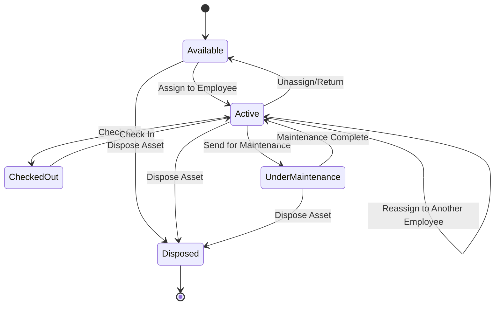

| ID | Requirement | Priority |
|----|-------------|----------|
| AT-001 | Assign asset to employee with: Employee ID, Assignment Date, Assignment Type (Permanent/Temporary), Location | Must Have |
| AT-002 | Support one employee having multiple assets (laptop + monitor + phone) | Must Have |
| AT-003 | Support shared assets assigned to Department/Location (projector, meeting room devices) | Must Have |
| AT-004 | Upon assignment, asset status changes from "Available" to "Active" | Must Have |
| AT-005 | Send email notification to employee upon asset assignment | Must Have |
| AT-006 | Log assignment transaction in audit trail | Must Have |
| AT-007 | Display assigned assets on employee profile/dashboard | Must Have |

#### 4.4.2 Asset Check-In / Check-Out

**Scenario 1: Temporary Check-Out (Travel/Work from Home)**

| ID | Requirement | Priority |
|----|-------------|----------|
| AT-101 | Employee/IT can check out asset with: Check-out Date, Reason, Expected Return Date | Must Have |
| AT-102 | Asset remains assigned to employee but status changes to "Checked Out" | Must Have |
| AT-103 | System logs: "Checked out for travel on Oct 21, 2025" | Must Have |
| AT-104 | Send reminder email 1 day before expected return date | Should Have |
| AT-105 | Upon check-in, asset status returns to "Active" | Must Have |

**Scenario 2: Permanent Return (Resignation/Project End)**

| ID | Requirement | Priority |
|----|-------------|----------|
| AT-201 | Employee initiates asset return request | Must Have |
| AT-202 | IT Admin verifies physical condition using checklist | Must Have |
| AT-203 | Upon check-in approval, system unassigns asset from employee | Must Have |
| AT-204 | Asset status changes to "Available" for next assignment | Must Have |
| AT-205 | Log return transaction with: Return Date, Condition Status, Remarks | Must Have |

#### 4.4.3 Asset Transfer Workflow

**Actors:** Employee (Requester), Manager (Approver), IT Team (Executor)

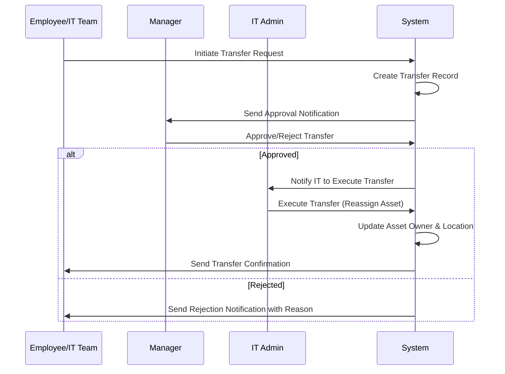

| ID | Requirement | Priority |
|----|-------------|----------|
| AT-301 | Transfer types: Employee → Employee, Department → Department, Location → Location | Must Have |
| AT-302 | Initiator submits transfer request with: Asset ID, New Owner/Dept/Location, Reason, Effective Date | Must Have |
| AT-303 | System routes to configured approver based on transaction type | Must Have |
| AT-304 | Approver can: Approve, Reject (with reason), Send Back for clarification | Must Have |
| AT-305 | Upon approval, IT Team executes transfer and updates asset assignment | Must Have |
| AT-306 | System logs complete transfer history in audit trail | Must Have |
| AT-307 | Send email notifications at each step (request, approval, completion) | Must Have |
| AT-308 | Display pending transfer requests on approver's dashboard | Must Have |

#### 4.4.4 Asset Search & Filtering

| ID | Requirement | Priority |
|----|-------------|----------|
| AT-401 | Global search by: Asset ID, Serial Number, Employee Name, Asset Name | Must Have |
| AT-402 | Advanced filters: Category, Status, Location, Department, Date Range, Cost Range | Must Have |
| AT-403 | Save frequently used filter combinations (user-specific) | Should Have |
| AT-404 | Export filtered results to Excel | Must Have |

---

### 4.5 Maintenance Management Module

**Actors:** IT Team, Employees

#### 4.5.1 Maintenance Request & Logging

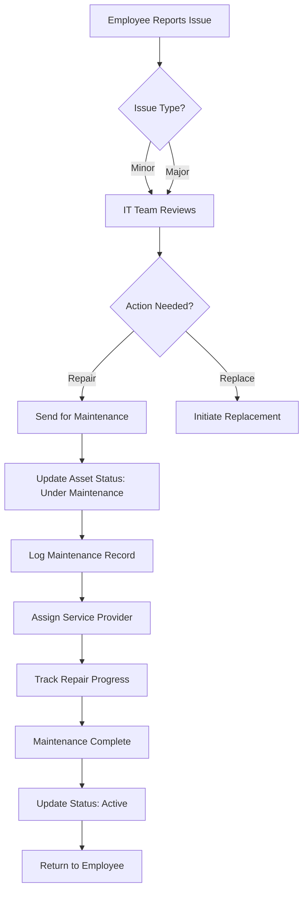

| ID | Requirement | Priority |
|----|-------------|----------|
| MM-001 | Employee reports issue via web/mobile with: Asset ID, Issue Description, Severity, Photos | Must Have |
| MM-002 | System creates maintenance request ticket with auto-generated Ticket ID | Must Have |
| MM-003 | IT Team reviews request and decides action: Repair, Replace, Close | Must Have |
| MM-004 | Upon sending for repair, asset status changes to "Under Maintenance" | Must Have |
| MM-005 | Asset remains assigned to employee during maintenance (unless replacement provided) | Must Have |
| MM-006 | Log maintenance details: Service Provider, Start Date, Expected Completion, Cost | Must Have |
| MM-007 | IT can provide loaner/replacement device during maintenance (optional) | Should Have |
| MM-008 | Upon maintenance completion, IT updates status back to "Active" | Must Have |
| MM-009 | System maintains complete maintenance history per asset | Must Have |

#### 4.5.2 Warranty Tracking

| ID | Requirement | Priority |
|----|-------------|----------|
| MM-101 | Track warranty expiry date for each asset | Must Have |
| MM-102 | Alert 30 days before warranty expiry (configurable: 15/30/60/90 days) | Must Have |
| MM-103 | Display warranty status on asset details page (Active/Expired/Expiring Soon) | Must Have |
| MM-104 | Generate monthly report of assets with expiring warranties | Should Have |

#### 4.5.3 AMC (Annual Maintenance Contract) Management

| ID | Requirement | Priority |
|----|-------------|----------|
| MM-201 | Record AMC details: Vendor, Contract Start/End Date, Cost, Coverage Details | Must Have |
| MM-202 | Link AMC to one or multiple assets | Must Have |
| MM-203 | Alert 60 days before AMC expiry | Must Have |
| MM-204 | Track maintenance visits under AMC | Should Have |

---

### 4.6 Financial Management Module

**Actors:** Finance Team, Tenant Admin

#### 4.6.1 Depreciation Calculation

**Default Depreciation Rules (Configurable):**
- Laptops/Desktops: 3 years (33.33% per year)
- Servers/Networking: 5 years (20% per year)
- Mobile Devices: 2 years (50% per year)
- Peripherals/Furniture: 4 years (25% per year)

**Supported Methods:**
- Straight Line Method (SLM)
- Written Down Value (WDV)

| ID | Requirement | Priority |
|----|-------------|----------|
| FM-001 | Admin configures depreciation method and rate per asset category | Must Have |
| FM-002 | System auto-calculates depreciation monthly from purchase date | Must Have |
| FM-003 | Display current book value on asset details: `Book Value = Purchase Cost - Accumulated Depreciation` | Must Have |
| FM-004 | Generate monthly depreciation report for all assets | Must Have |
| FM-005 | Generate year-end depreciation summary for accounting | Must Have |
| FM-006 | Allow manual depreciation entry for exceptional cases (with approval) | Should Have |

#### 4.6.2 Asset Valuation

| ID | Requirement | Priority |
|----|-------------|----------|
| FM-101 | Track: Purchase Cost, Current Book Value, Salvage Value, Accumulated Maintenance Cost | Must Have |
| FM-102 | Display total asset value by: Category, Department, Location | Must Have |
| FM-103 | Generate asset valuation report as of specific date | Must Have |

#### 4.6.3 Budget Tracking

| ID | Requirement | Priority |
|----|-------------|----------|
| FM-201 | Admin sets annual asset purchase budget per department | Must Have |
| FM-202 | Track budget utilization: Allocated vs Spent vs Available | Must Have |
| FM-203 | Alert when department budget utilization > 80% | Should Have |
| FM-204 | Display budget dashboard with visual indicators (green/yellow/red) | Should Have |

#### 4.6.4 Asset Disposal

| ID | Requirement | Priority |
|----|-------------|----------|
| FM-301 | IT Team initiates disposal request with: Asset ID, Disposal Reason, Expected Disposal Value | Must Have |
| FM-302 | Disposal requires Finance and Admin approval | Must Have |
| FM-303 | Upon approval, record: Disposal Date, Actual Disposal Value, Approved By | Must Have |
| FM-304 | Asset status changes to "Disposed" and is excluded from active inventory | Must Have |
| FM-305 | Generate disposal certificate (PDF) with asset details and approvals | Should Have |
| FM-306 | Support document upload (disposal receipt, certificate) | Should Have |

---

### 4.7 Employee Master Module

**Actors:** Tenant Admin, IT Team (Read-only for assignment)

| ID | Requirement | Priority |
|----|-------------|----------|
| EM-001 | Create employee record with: Employee ID, Name, Email, Department, Designation, Manager, Location, Status (Active/Inactive) | Must Have |
| EM-002 | Employee ID must be unique within tenant | Must Have |
| EM-003 | Link employee to Manager (hierarchical structure) | Must Have |
| EM-004 | Bulk import employees from Excel template | Must Have |
| EM-005 | When employee status = Inactive, system flags for asset return and license reclaim | Must Have |
| EM-006 | Display employee asset allocation on employee profile | Must Have |
| EM-007 | Support custom employee fields (e.g., Cost Center, Project Code) | Should Have |

**Note:** Future HRMS integration will sync employee data automatically.

---

### 4.8 User & Role Management Module

**Actors:** Tenant Admin

#### 4.8.1 User Management

| ID | Requirement | Priority |
|----|-------------|----------|
| UM-001 | Create user account with: Username, Email, Password, Role, Department, Location | Must Have |
| UM-002 | Username and Email must be unique within tenant | Must Have |
| UM-003 | Password must meet complexity rules: Min 8 characters, 1 uppercase, 1 number, 1 special character | Must Have |
| UM-004 | Force password change on first login | Must Have |
| UM-005 | Link user to employee record (optional) | Should Have |
| UM-006 | Support user status: Active, Inactive, Locked | Must Have |
| UM-007 | Auto-lock user after 5 failed login attempts | Must Have |
| UM-008 | Tenant Admin can reset user passwords | Must Have |
| UM-009 | Users can change their own password | Must Have |
| UM-010 | Log all user login activity (timestamp, IP address) | Must Have |

#### 4.8.2 Role-Based Access Control

| ID | Requirement | Priority |
|----|-------------|----------|
| UM-101 | Define permissions at module level (Asset Management, User Management, Reports, etc.) | Must Have |
| UM-102 | System enforces role-based access on all API endpoints and UI screens | Must Have |
| UM-103 | Admin can create custom roles with selected permissions | Should Have |
| UM-104 | Data-level filtering: Managers see only department data, Employees see only own data | Must Have |

---

### 4.9 Notification Module

**Actors:** System (Automated), All Users (Recipients)

#### 4.9.1 Email Notifications

| ID | Requirement | Priority |
|----|-------------|----------|
| NM-001 | Send email for: Asset Assignment, Transfer Request, Approval/Rejection, Warranty Expiry, License Expiry, Overdue Returns | Must Have |
| NM-002 | Tenant Admin can customize email templates (subject, body, logo) | Should Have |
| NM-003 | System uses SMTP configuration provided by tenant | Must Have |
| NM-004 | Log all sent emails for audit | Should Have |

#### 4.9.2 In-App Notifications

| ID | Requirement | Priority |
|----|-------------|----------|
| NM-101 | Display bell icon with unread notification count | Should Have |
| NM-102 | Notification types: Pending Approvals, Alerts, System Announcements | Should Have |
| NM-103 | Mark notifications as read/unread | Should Have |
| NM-104 | Clicking notification navigates to relevant page | Should Have |

---

### 4.10 Mobile Interface (PWA)

**Actors:** IT Team, Employees

**Phase 1 Scope: Progressive Web App (Responsive Web)**

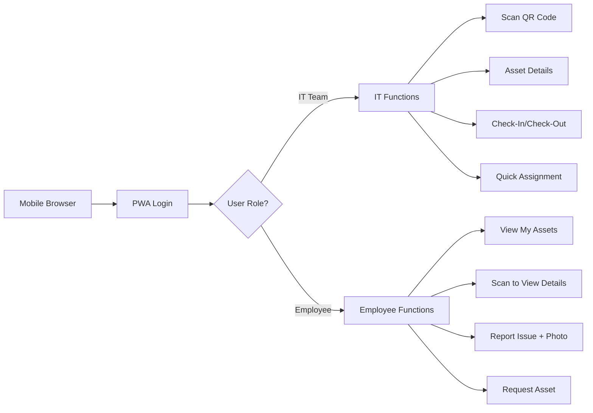

| ID | Requirement | Priority |
|----|-------------|----------|
| MB-001 | PWA works on mobile browsers (iOS Safari, Android Chrome) without app store installation | Must Have |
| MB-002 | Responsive design optimized for mobile screens (portrait orientation) | Must Have |
| MB-003 | Camera access for QR code scanning and photo upload | Must Have |
| MB-004 | Offline capability NOT required (always online) | Must Have |

#### 4.10.1 QR Code Scanning

| ID | Requirement | Priority |
|----|-------------|----------|
| MB-101 | Scan QR code using device camera | Must Have |
| MB-102 | Upon successful scan, immediately display asset details page | Must Have |
| MB-103 | Asset details page shows: Asset ID, Name, Status, Current Owner, Location, Warranty Status | Must Have |
| MB-104 | Quick action buttons: Check-In, Check-Out, Report Issue, View History | Must Have |

#### 4.10.2 Issue Reporting

| ID | Requirement | Priority |
|----|-------------|----------|
| MB-201 | Report issue form: Asset ID (auto-filled from scan), Issue Description, Severity (Low/Medium/High) | Must Have |
| MB-202 | Capture photo of damaged asset (max 3 photos) | Must Have |
| MB-203 | Submit issue and receive confirmation with Ticket ID | Must Have |

#### 4.10.3 Employee Self-Service

| ID | Requirement | Priority |
|----|-------------|----------|
| MB-301 | View list of all assigned assets | Must Have |
| MB-302 | View asset details and history | Must Have |
| MB-303 | Initiate asset return request | Must Have |

---

### 4.11 Vendor Management Module

**Actors:** IT Team, Finance Team

| ID | Requirement | Priority |
|----|-------------|----------|
| VM-001 | Create vendor record with: Vendor Name, Contact Person, Email, Phone, Address, GST/Tax Number | Must Have |
| VM-002 | Link vendors to: Assets Purchased, AMC Contracts, Maintenance Services | Must Have |
| VM-003 | Track vendor transactions: Purchase Orders, Invoices, Payments | Should Have |
| VM-004 | Display vendor-wise asset count and total purchase value | Should Have |

---

## 5. Business Rules

### 5.1 Asset Management Rules

| Rule ID | Business Rule |
|---------|---------------|
| BR-001 | Each asset must have a unique system-generated Asset ID |
| BR-002 | Asset Serial Number must be unique within tenant (if provided) |
| BR-003 | Purchase Date cannot be a future date |
| BR-004 | Warranty Expiry Date must be >= Purchase Date |
| BR-005 | An asset can be assigned to only one employee at a time (except shared assets) |
| BR-006 | Asset status "Disposed" is permanent and irreversible |
| BR-007 | Asset cannot be deleted, only marked as Disposed |
| BR-008 | Depreciation starts from Purchase Date, not assignment date |

### 5.2 Assignment & Transfer Rules

| Rule ID | Business Rule |
|---------|---------------|
| BR-101 | Asset must be in "Available" status to be assigned |
| BR-102 | Asset transfer requires manager approval |
| BR-103 | Two-level approval required if asset value > $5,000 (configurable) |
| BR-104 | Check-out is only allowed for assets in "Active" status |
| BR-105 | Asset return automatically unassigns and changes status to "Available" |
| BR-106 | Shared assets cannot be checked out (department/location assets) |

### 5.3 Maintenance Rules

| Rule ID | Business Rule |
|---------|---------------|
| BR-201 | Maintenance can be logged only for assets in "Active" status |
| BR-202 | Asset status auto-changes to "Under Maintenance" when sent for repair |
| BR-203 | All maintenance costs must be logged against the asset record |
| BR-204 | Maintenance history is permanent and cannot be deleted |

### 5.4 Financial Rules

| Rule ID | Business Rule |
|---------|---------------|
| BR-301 | Depreciation method cannot be changed once set for an asset |
| BR-302 | Book Value cannot be negative |
| BR-303 | Disposal requires both Finance and Admin approval |
| BR-304 | Budget cannot be exceeded without approval override |

### 5.5 User & Security Rules

| Rule ID | Business Rule |
|---------|---------------|
| BR-401 | Only one active session allowed per user |
| BR-402 | Session timeout after 30 minutes of inactivity |
| BR-403 | All user actions are logged in audit trail |
| BR-404 | Audit logs are retained for 90 days |
| BR-405 | Only Tenant Admin can create/deactivate users |

---

## 6. Workflows

### 6.1 Asset Lifecycle Workflow

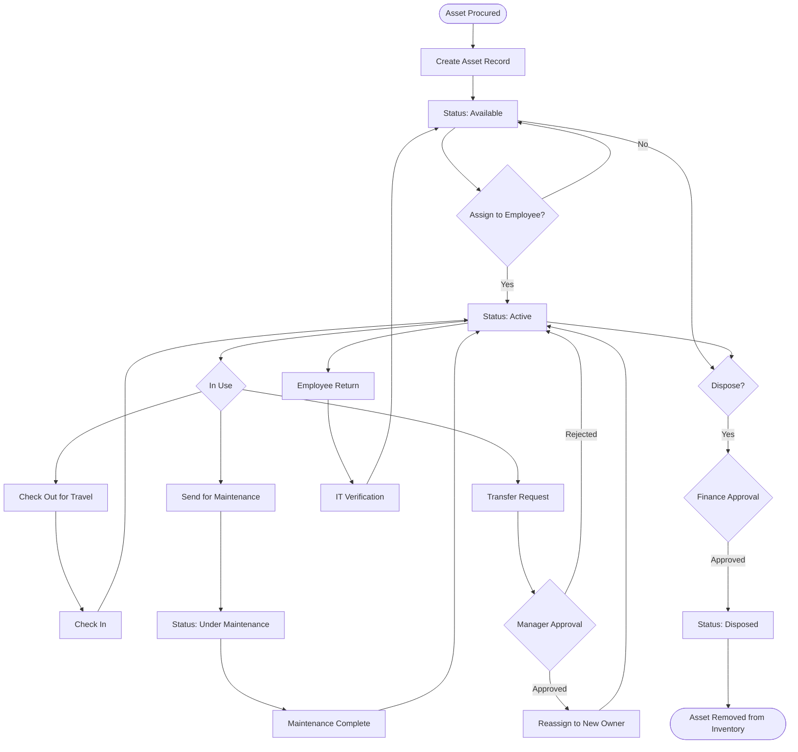

### 6.2 Transfer Approval Workflow

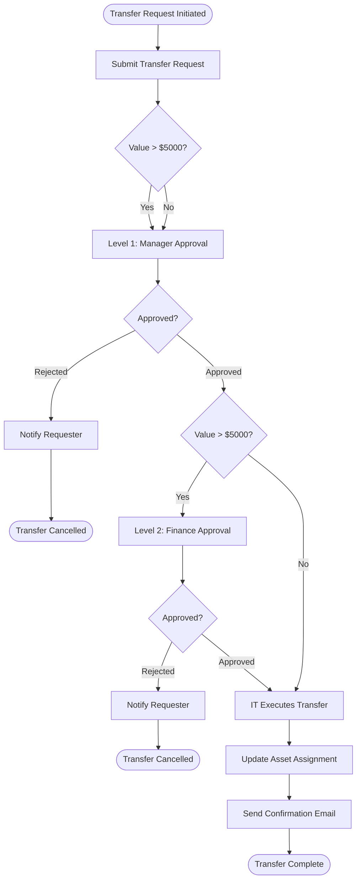

### 6.3 Maintenance Request Workflow

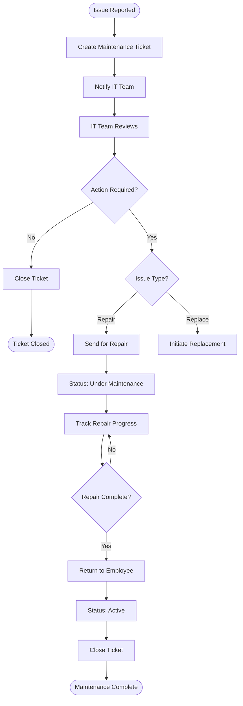

### 6.4 Employee Offboarding Workflow

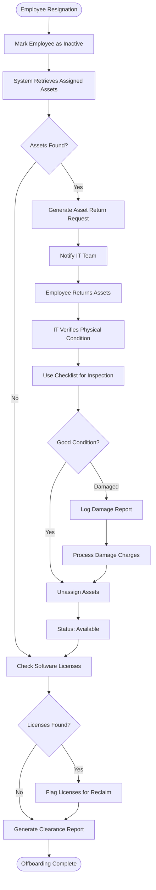

---

## 7. Data Model

### 7.1 Core Entities

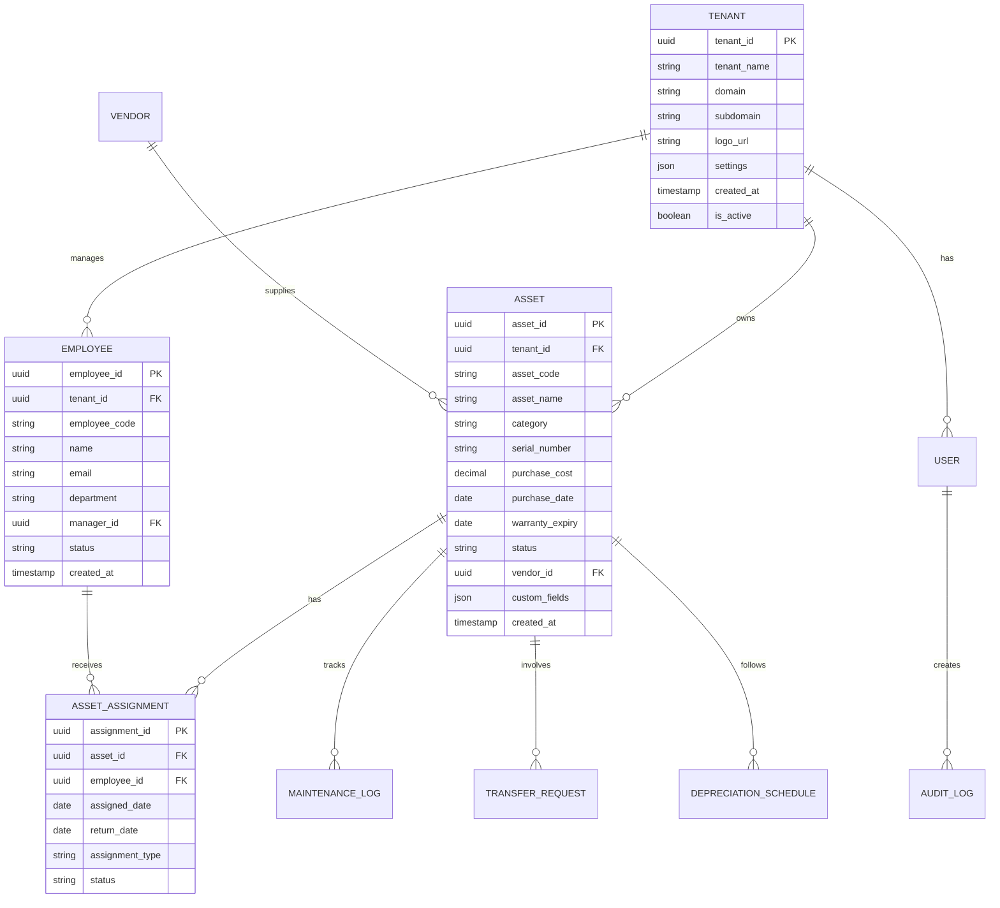

### 7.2 Key Database Tables

#### 7.2.1 Asset Table

| Column | Type | Constraints | Description |
|--------|------|-------------|-------------|
| asset_id | UUID | PK | Unique identifier |
| tenant_id | UUID | FK, NOT NULL | Tenant reference |
| asset_code | VARCHAR(50) | UNIQUE, NOT NULL | e.g., LAP-2025-0001 |
| asset_name | VARCHAR(200) | NOT NULL | Asset name |
| category | VARCHAR(50) | NOT NULL | Asset category |
| serial_number | VARCHAR(100) | UNIQUE | Serial/MAC address |
| purchase_cost | DECIMAL(15,2) | NOT NULL | Purchase price |
| purchase_date | DATE | NOT NULL | Purchase date |
| warranty_expiry | DATE | NULL | Warranty end date |
| status | VARCHAR(30) | NOT NULL | Available, Active, etc. |
| current_book_value | DECIMAL(15,2) | NULL | Calculated value |
| location | VARCHAR(100) | NULL | Physical location |
| department | VARCHAR(100) | NULL | Assigned department |
| vendor_id | UUID | FK, NULL | Vendor reference |
| qr_code_url | VARCHAR(500) | NULL | QR code image URL |
| custom_fields | JSONB | NULL | Dynamic fields |
| created_by | UUID | FK | User who created |
| created_at | TIMESTAMP | NOT NULL | Creation timestamp |
| updated_at | TIMESTAMP | NOT NULL | Last update |

#### 7.2.2 Software License Table

| Column | Type | Constraints | Description |
|--------|------|-------------|-------------|
| license_id | UUID | PK | Unique identifier |
| tenant_id | UUID | FK, NOT NULL | Tenant reference |
| software_name | VARCHAR(200) | NOT NULL | Software name |
| license_type | VARCHAR(30) | NOT NULL | Perpetual/Subscription |
| vendor_id | UUID | FK | Vendor reference |
| total_quantity | INT | NOT NULL | Total licenses |
| cost_per_license | DECIMAL(10,2) | NOT NULL | Cost per unit |
| purchase_date | DATE | NOT NULL | Purchase date |
| expiry_date | DATE | NULL | For subscriptions |
| renewal_frequency | VARCHAR(20) | NULL | Monthly/Annual |
| assignment_type | VARCHAR(30) | NOT NULL | User/Device/Department |

---

## 8. User Interface Requirements

### 8.1 General UI Principles
- **Responsive Design:** Support desktop (1920x1080), tablet (1024x768), mobile (375x667)
- **Accessibility:** WCAG 2.1 Level AA compliance
- **Theme:** Tenant-customizable color scheme with light mode default
- **Navigation:** Sidebar menu with collapsible sections, breadcrumb navigation

### 8.2 Dashboard Layout

**Admin/IT Team Dashboard:**
- KPI Cards: Total Assets, Active Assets, Assets in Maintenance, Available Assets
- Charts: Asset Distribution by Category (Pie), Asset Value by Department (Bar), Monthly Depreciation (Line)
- Recent Activities: Last 10 transactions (assignments, transfers, maintenance)
- Alerts Section: Warranty Expiries (next 30 days), License Expiries, Overdue Returns, Pending Approvals

**Employee Dashboard:**
- My Assets: List view with Asset Code, Name, Category, Assignment Date, Status
- Quick Actions: Report Issue, View History
- Notifications: Pending actions, system announcements

### 8.3 Key Screens

#### 8.3.1 Asset Registration Form
- Multi-step form: Basic Info → Financial Details → Documents → Review
- Mandatory field indicators (red asterisk)
- Real-time validation with error messages
- Preview QR code before saving

#### 8.3.2 Asset Detail Page
- Tabs: Overview, Assignment History, Maintenance Log, Documents, Financial Info
- Action buttons (context-aware): Assign, Transfer, Check-Out, Report Issue, Dispose
- Visual timeline of asset lifecycle events
- Downloadable asset report (PDF)

#### 8.3.3 Asset List/Grid View
- Filterable columns with multi-select dropdowns
- Sortable columns (ascending/descending)
- Bulk action toolbar: Export, Print Labels, Bulk Edit
- Pagination with configurable rows per page (10/25/50/100)
- Quick view modal on row click

---

## 9. Integration Requirements

### 9.1 API Architecture

**RESTful API Design:**
- Base URL: `https://api.assetica.io/v1/{tenant-id}/`
- Authentication: JWT (JSON Web Token) with refresh token mechanism
- Rate Limiting: 1000 requests per hour per user
- Response Format: JSON with standard structure:

```json
{
  "status": "success|error",
  "message": "Description",
  "data": {},
  "meta": {
    "timestamp": "ISO 8601",
    "request_id": "UUID"
  }
}
```

### 9.2 Third-Party Integration Readiness

**Phase 2 Integration Points:**
- ERP/Accounting Systems (SAP, Oracle, QuickBooks, Tally)
- HRMS Systems (Workday, BambooHR, Zoho People)
- Email Gateway (SendGrid, AWS SES)
- Cloud Storage (AWS S3, Azure Blob) for documents

**Required APIs:**
- GET `/api/assets` - List assets
- POST `/api/assets` - Create asset
- PUT `/api/assets/{id}` - Update asset
- GET `/api/assets/{id}/depreciation` - Get depreciation schedule
- POST `/api/assets/{id}/assign` - Assign asset

---

## 10. Reporting & Analytics

### 10.1 Standard Reports

| Report Name | Description | Filters | Output Format |
|-------------|-------------|---------|---------------|
| Asset Register | Complete inventory list | Category, Status, Location, Date Range | Excel, PDF |
| Asset Allocation | Assets by employee/department | Department, Employee | Excel, PDF |
| Depreciation Schedule | Monthly/Annual depreciation | Category, Date Range | Excel, PDF |
| Maintenance History | All maintenance logs | Asset, Date Range, Service Provider | Excel, PDF |
| Warranty Expiry | Assets with expiring warranties | Days to Expiry (30/60/90) | Excel, PDF |
| Asset Valuation | Total asset value summary | Category, Department, Location | Excel, PDF |
| License Utilization | Software license usage | Software, License Type | Excel, PDF |
| Disposal Register | Disposed assets | Date Range, Reason | Excel, PDF |
| Budget Utilization | Department-wise budget status | Department, Fiscal Year | Excel, PDF |
| Audit Trail | User activity log | User, Date Range, Action Type | Excel, PDF |

### 10.2 Dashboard Analytics

**Visual Widgets:**
- Asset Count by Status (Donut Chart)
- Top 5 Departments by Asset Value (Horizontal Bar)
- Monthly Asset Additions vs Disposals (Line Chart)
- Maintenance Cost Trend (Area Chart)
- Asset Age Distribution (Histogram)
- License Expiry Calendar (Heatmap)

---

## 11. Non-Functional Requirements

### 11.1 Performance

| Requirement | Target | Measurement |
|-------------|--------|-------------|
| Page Load Time | < 2 seconds | 95th percentile |
| API Response Time | < 500ms | Average |
| Concurrent Users | 500 per tenant | Load test |
| Database Query Time | < 100ms | Average |
| File Upload | 10MB in < 5 seconds | 50 Mbps connection |

### 11.2 Security

| Requirement | Implementation |
|-------------|----------------|
| Authentication | JWT with 1-hour expiry, 7-day refresh token |
| Password Storage | Bcrypt hashing (cost factor 12) |
| Data Encryption | TLS 1.3 for transit, AES-256 for sensitive data at rest |
| RBAC | Module-level permissions enforced at API gateway |
| Audit Logging | All CRUD operations logged with user, timestamp, IP |
| Session Management | Single active session, 30-min inactivity timeout |
| API Security | Rate limiting, CORS policy, input validation |

### 11.3 Scalability

- **Horizontal Scaling:** Stateless application servers with load balancer
- **Database:** PostgreSQL with read replicas
- **Caching:** Redis for session storage and frequently accessed data
- **File Storage:** AWS S3/Azure Blob with CDN for images and documents
- **Multi-Tenancy:** Database per tenant model for complete isolation

### 11.4 Availability & Reliability

| Metric | Target |
|--------|--------|
| System Uptime | 99.5% (monthly) |
| Planned Maintenance Window | 4 hours/month (off-peak) |
| Data Backup | Daily automated backups, 30-day retention |
| Disaster Recovery | RPO: 24 hours, RTO: 4 hours |

### 11.5 Usability

- **Onboarding:** Interactive tutorial for first-time users
- **Help Documentation:** Context-sensitive help tooltips, knowledge base
- **User Training:** Video tutorials, PDF user manual
- **Browser Support:** Chrome 90+, Firefox 88+, Safari 14+, Edge 90+

---

## 12. Assumptions & Constraints

### 12.1 Assumptions

1. Tenants have stable internet connectivity (minimum 10 Mbps)
2. Users have basic computer literacy
3. Barcode/QR scanning via mobile camera is acceptable for Phase 1
4. Email is the primary notification channel
5. Initial deployment will be on AWS (Azure as backup)
6. Maximum 10,000 assets per tenant in Phase 1

### 12.2 Constraints

1. **Budget Constraint:** Development within approved budget
2. **Timeline Constraint:** Phase 1 MVP in 6 months
3. **Resource Constraint:** 5-member development team
4. **Technology Constraint:** Must use PostgreSQL (no NoSQL)
5. **Compliance Constraint:** GDPR-ready for EU tenants (data residency)

### 12.3 Out of Scope (Phase 1)

- Native mobile apps (iOS/Android)
- IoT/RFID hardware integration
- AI-based predictive maintenance
- Advanced procurement workflow (PO, GRN, Vendor comparison)
- Physical audit reconciliation module
- SSO/SAML integration
- Multi-language support
- API marketplace for third-party integrations

---

## 13. Acceptance Criteria

### 13.1 Functional Acceptance

- [ ] All Phase 1 features implemented as per functional requirements
- [ ] 100% of must-have requirements completed
- [ ] 80% of should-have requirements completed
- [ ] User roles and permissions working correctly
- [ ] Mobile PWA functional on iOS and Android browsers
- [ ] Bulk import/export working without errors
- [ ] Email notifications being sent correctly
- [ ] All workflows (assignment, transfer, maintenance) operational
- [ ] Reports generating accurate data

### 13.2 Technical Acceptance

- [ ] API response time < 500ms for 95% of requests
- [ ] System handles 500 concurrent users without degradation
- [ ] Zero critical security vulnerabilities (per OWASP scan)
- [ ] Code coverage > 80% for unit tests
- [ ] Database performance optimized (all queries < 100ms)
- [ ] Successfully deployed to staging environment
- [ ] Disaster recovery tested and documented

### 13.3 User Acceptance Testing (UAT)

- [ ] UAT conducted with minimum 10 users across all roles
- [ ] UAT feedback incorporated into final release
- [ ] User documentation reviewed and approved
- [ ] Training sessions conducted for pilot tenant

---

## 14. Appendices

### Appendix A: Glossary

| Term | Definition |
|------|------------|
| Assetica | Cloud-based multi-tenant asset management platform |
| Asset | Any physical or intangible resource owned by the organization |
| Tenant | An organization/company using the Assetica platform |
| Check-out | Temporary removal of asset from normal location (e.g., travel) |
| Check-in | Return of asset to inventory |
| Depreciation | Reduction in asset value over time |
| AMC | Annual Maintenance Contract with vendor |
| GRN | Goods Received Note (proof of asset receipt) |
| PWA | Progressive Web App (responsive web application) |

### Appendix B: Acronyms

| Acronym | Full Form |
|---------|-----------|
| API | Application Programming Interface |
| RBAC | Role-Based Access Control |
| SLM | Straight Line Method (depreciation) |
| WDV | Written Down Value (depreciation) |
| UAT | User Acceptance Testing |
| MVP | Minimum Viable Product |
| CRUD | Create, Read, Update, Delete |
| JWT | JSON Web Token |

### Appendix C: Sample Asset ID Formats

| Category | Prefix | Example |
|----------|--------|---------|
| Laptop | LAP | LAP-2025-0001 |
| Monitor | MON | MON-2025-0045 |
| Server | SRV | SRV-2025-0010 |
| Mobile | MOB | MOB-2025-0123 |
| Software | SFT | SFT-2025-0005 |

---

## Document Approval

| Role | Name | Signature | Date |
|------|------|-----------|------|
| Business Owner | [TBD] | | |
| Technical Lead | [TBD] | | |
| QA Lead | [TBD] | | |
| Project Manager | [TBD] | | |

---

## Document Information

**Product Name:** Assetica  
**Product Website:** https://assetica.io  
**API Documentation:** https://docs.assetica.io  
**Support:** support@assetica.io  

**Document Classification:** Internal - Confidential  
**Distribution:** Development Team, Product Management, Stakeholders  

---

**© 2025 Assetica. All Rights Reserved.**

*This document contains proprietary information and may not be distributed without authorization.*

---

**End of Document**